# Lab 0 Walkthrough: The Leaked Paper

> ⚠️ **Spoilers.** This is the full solution to [Lab 0](../README.md). Try the lab on your own first.

| | |
|---|---|
| **Case type** | Insider data leak (exam paper) |
| **Evidence** | Damaged USB drive, supplied as a 512 MB raw disk image (`case01.img`) |
| **Difficulty** | Sample, Easy to Medium |
| **Tools used** | `sha256sum`, `file`, `fdisk`, `mmls`, `xxd`, `grep`, TestDisk, `fls`, `icat`, `istat`, `exiftool`, `unzip`, `cat` |
| **Environment** | Ubuntu VM (VMware) |
| **Author** | Abiral Timalsina |

All people, organisations, phone numbers and payments in this case are **fictional**.

---|---|
| **Case type** | Insider data leak (exam paper) |
| **Evidence** | Damaged USB drive, supplied as a 512 MB raw disk image (`case01.img`) |
| **Difficulty** | Easy to Medium |
| **Tools used** | `sha256sum`, `file`, `fdisk`, `mmls`, `xxd`, `grep`, TestDisk, `fls`, `icat`, `istat`, `exiftool`, `unzip`, `cat` |
| **Environment** | Ubuntu VM (VMware) |
| **Author** | Abiral Timalsina |

All people, organisations, phone numbers and payments in this case are **fictional**.

---

## 1. Case brief

A BCA 4th-semester *Database Management System* paper at *Himalayan Model College* appeared in a student group the night before the exam, and the exam was cancelled. A USB drive was found plugged into the PC in the exam section's photocopy room. The drive shows "You need to format the disk", and nobody claims it.

**Task:** find out what happened and who is most likely responsible.

---

## 2. Investigation method

1. Protect the evidence (hash, then work on copies)
2. Understand the drive (size, partition layout, first sector)
3. Locate the lost file system and repair the partition table (on a copy)
4. List everything, including deleted entries
5. Recover deleted files and check what each file really is
6. Read metadata (author, camera, dates)
7. Examine the disguised file and the hidden stream
8. Build the timeline from the file system
9. Conclude, and state what cannot be proven

---

## 3. Step by step

### Step 1: Protect the evidence

The original image was fingerprinted when sealed, then copied. The first check passed and the working copy had an identical fingerprint.

```bash
sha256sum -c case01.sha256
sha256sum case01.img working.img
cp case01.img working.img
```

Original SHA-256: `1fc14dfb1ddf5ca96f60103a28f94df3014a33a9e460abf98f9dc97da831dcae`

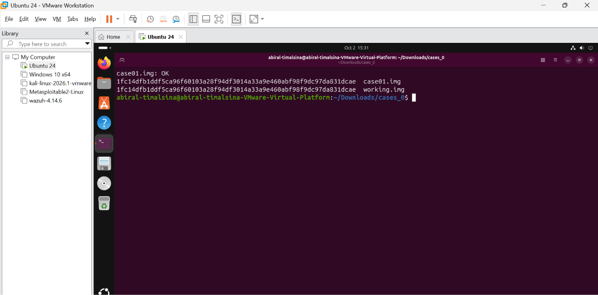

### Step 2: What is this drive?

```bash
ls -lh working.img
file working.img
fdisk -l working.img
mmls working.img; echo "exit code: $?"
```

| Command | Result | Meaning |
|---|---|---|
| `ls -lh` | 512 MB | USB-sized drive |
| `file` | `data` | Start of the drive is not recognised |
| `fdisk -l` | No partition list | Partition table missing |
| `mmls` | No output, exit code 1 | No partition layout found |

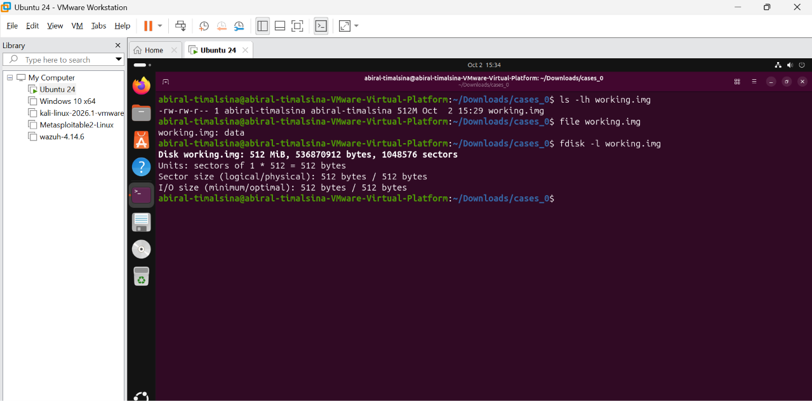
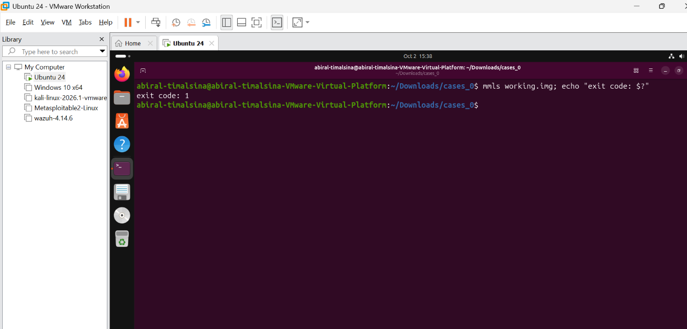

### Step 3: The first sector

```bash
xxd -l 512 working.img
```

The last two bytes of the sector are `3c 9c`, **not** the boot signature `55 aa`, and the partition table area holds random-looking bytes. The first sector has been overwritten.

```
000001f0: 0b76 f6e6 54a2 a5e2 7ba9 4e0f 5335 3c9c  .v..T...{.N.S5<.
```

### Step 4: Is a file system still there?

```bash
grep -a -b -o "NTFS" working.img | head
```

```
1048579:NTFS
1130997:NTFS
536870403:NTFS
```

`1048579` minus 3 is `1048576`, which is sector 2048. The match at the end of the image fits NTFS's backup boot sector. Reading that location directly confirms a healthy NTFS boot sector ending in `55 aa`:

```bash
xxd -s 1048576 -l 512 working.img | tail -2
```

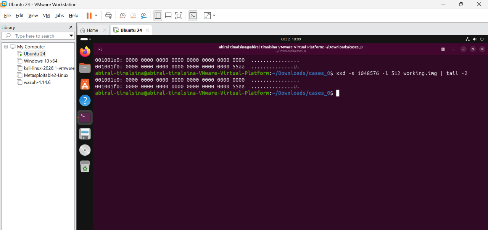

**Finding:** the partition table was wiped, but an NTFS file system survives from sector 2048.

### Step 5: Repair the partition table (on a copy)

```bash
cp working.img repair.img
testdisk repair.img
```

TestDisk: Create log, select `repair.img`, partition type **Intel**, **Analyse**, **Quick Search**, then **Write**.

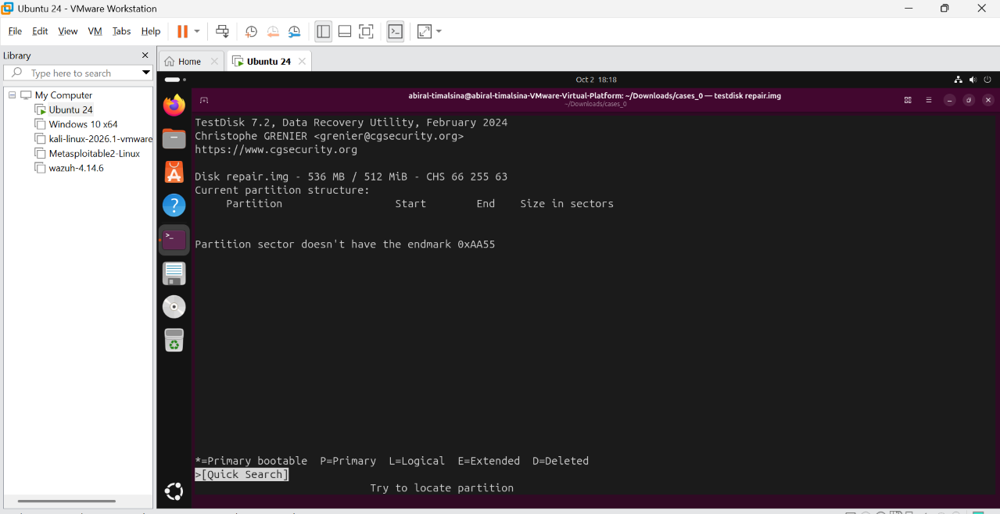
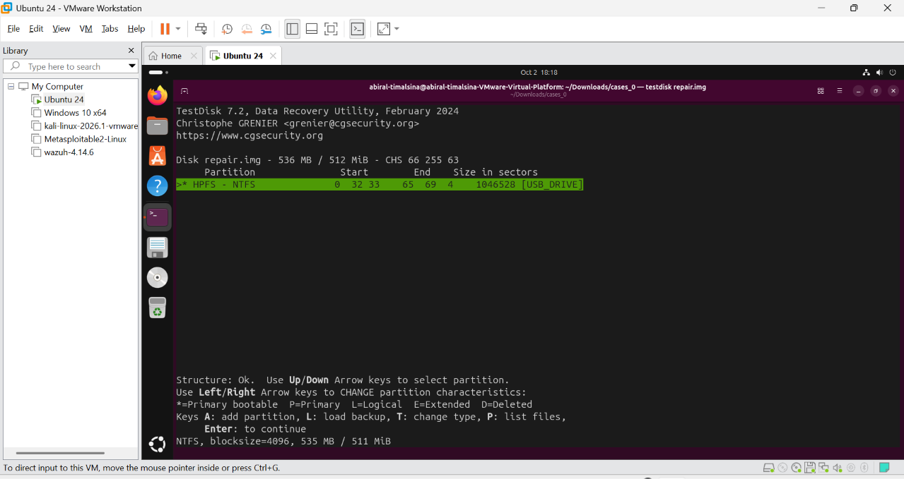
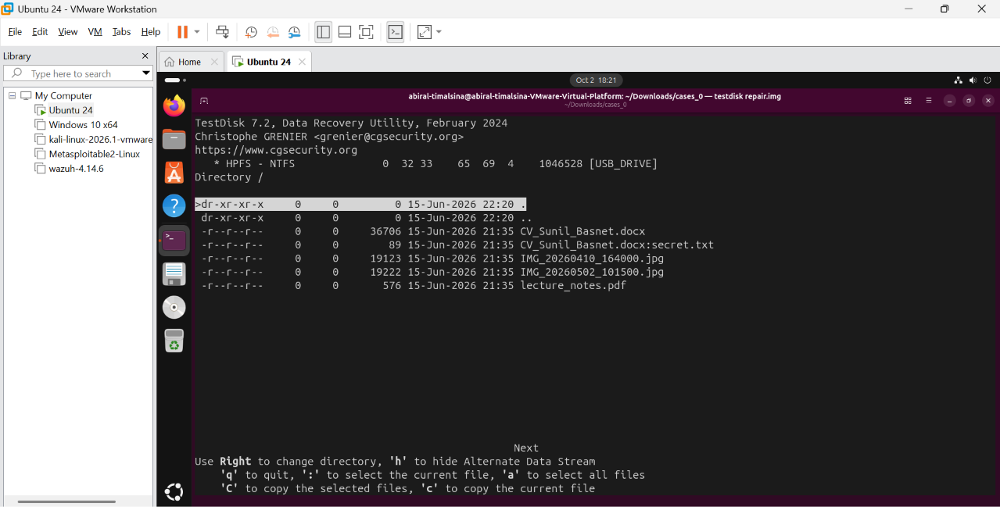
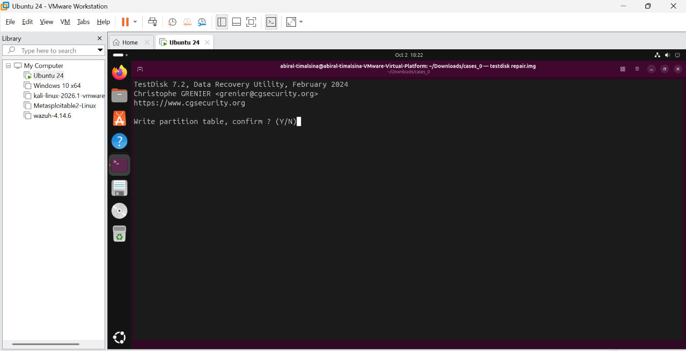

### Step 6: Verify the repair and prove the evidence is untouched

```bash
file repair.img
fdisk -l repair.img
mmls repair.img
sha256sum case01.img working.img repair.img
```

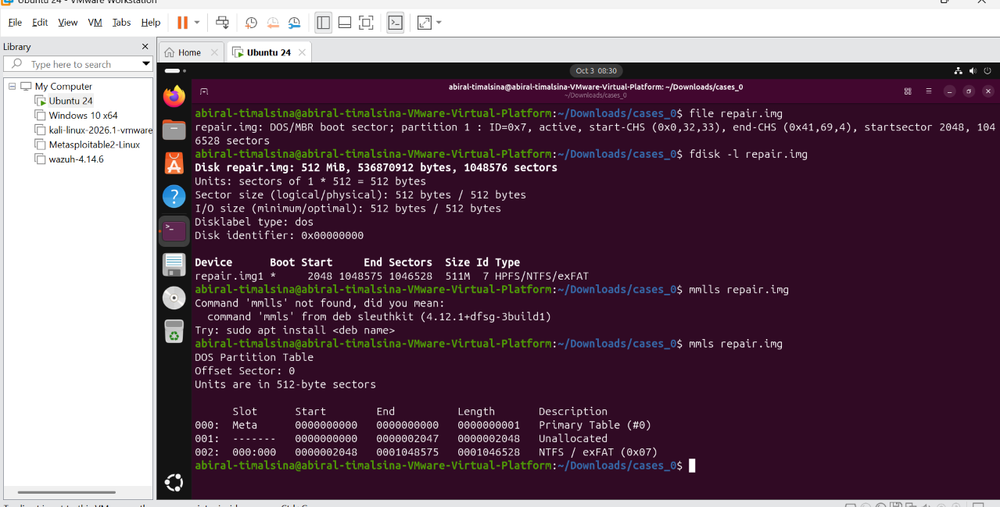
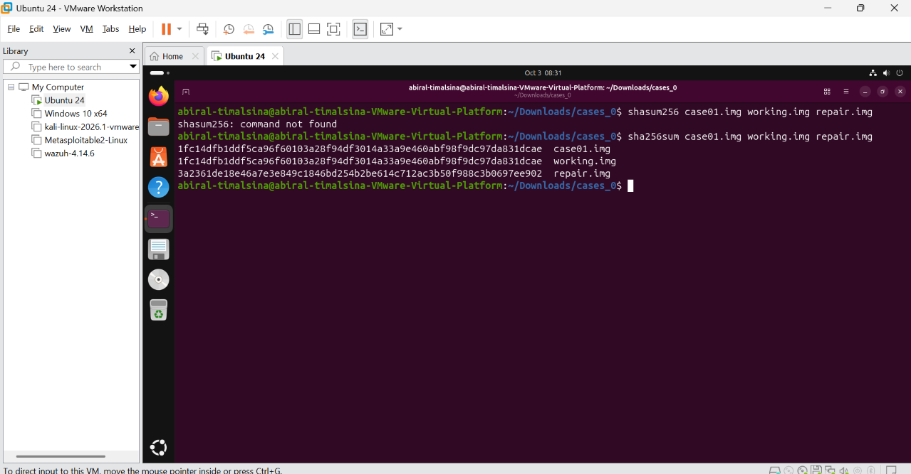

`case01.img` and `working.img` still share the fingerprint `1fc14dfb…`; only `repair.img` differs (`3a2361de…`).

### Step 7: List all files, including deleted ones

```bash
fls -o 2048 -r repair.img
```

Entries marked `*` are deleted but still listed:

| Entry | Name | Status |
|---|---|---|
| 64 | `CV_Sunil_Basnet.docx` (and a stream `:secret.txt`) | Normal |
| 66, 67 | `IMG_20260410_164000.jpg`, `IMG_20260502_101500.jpg` | Normal |
| 70 | `lecture_notes.pdf` | Normal (suspicious: 576 bytes) |
| 65 | `DBMS_Final_Paper_2026.docx` | **Deleted** |
| 68, 69 | `IMG_20260615_213210.jpg`, `IMG_20260615_213244.jpg` | **Deleted** |

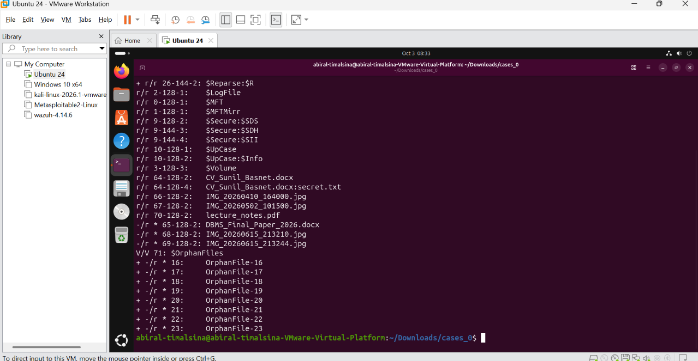

### Step 8: Recover the deleted files

```bash
mkdir recovered
icat -o 2048 repair.img 65 > recovered/DBMS_Final_Paper_2026.docx
icat -o 2048 repair.img 68 > recovered/IMG_20260615_213210.jpg
icat -o 2048 repair.img 69 > recovered/IMG_20260615_213244.jpg
ls -l recovered
file recovered/*
sha256sum recovered/*
```

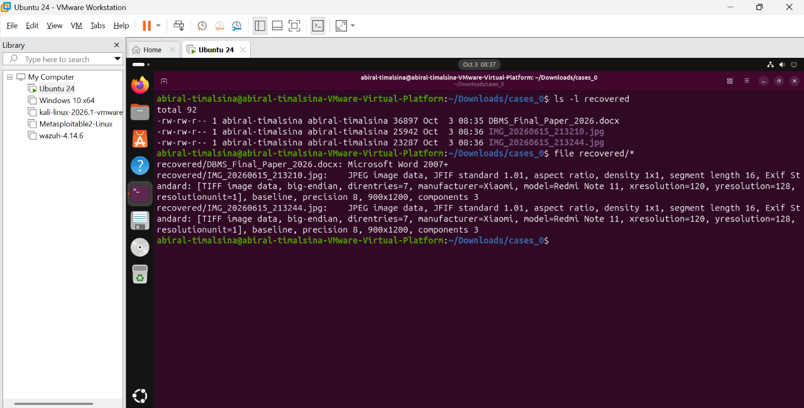
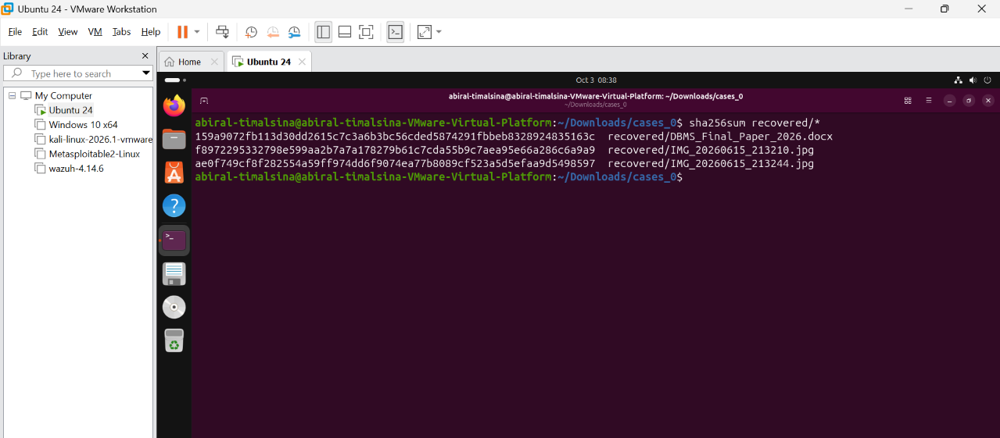

### Step 9: Metadata

```bash
exiftool recovered/DBMS_Final_Paper_2026.docx
exiftool recovered/IMG_20260615_213210.jpg
```

**Document**

| Field | Value |
|---|---|
| Creator | Hari Sharma |
| Last Modified By | Sunil Basnet |
| Created | 2026-06-14 18:20 |
| Modified | 2026-06-15 20:45 |

**Photos:** Xiaomi Redmi Note 11, taken 2026-06-15 at 21:32:10 and 21:32:44.

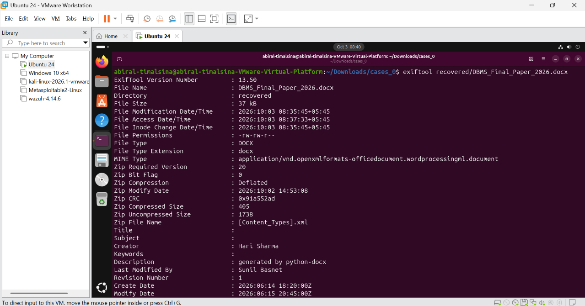
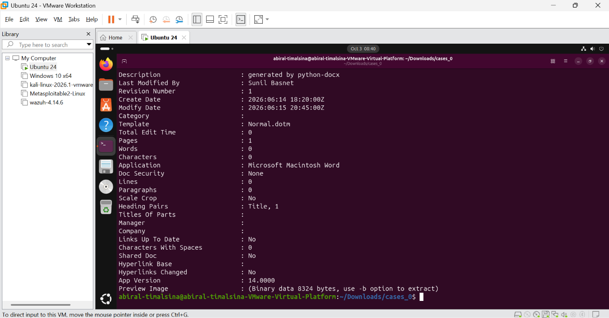
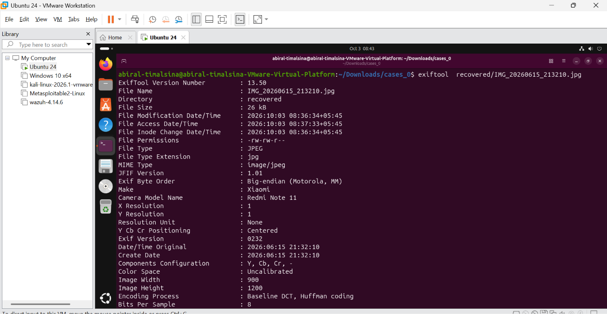

### Step 10: Do the personal photos match the same phone?

```bash
icat -o 2048 repair.img 66 > recovered/IMG_20260410_164000.jpg
icat -o 2048 repair.img 67 > recovered/IMG_20260502_101500.jpg
exiftool -Make -Model -DateTimeOriginal -FileName recovered/*.jpg
```

All four photos came from a Xiaomi Redmi Note 11. This is a lead, not proof, because it is a common phone model.

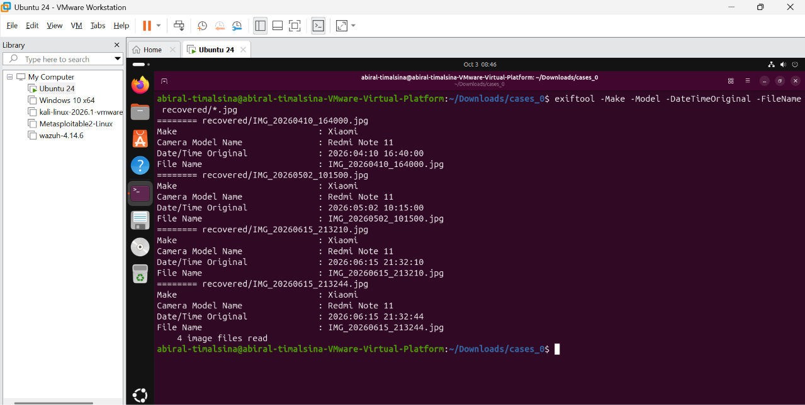

### Step 11: The disguised file

```bash
icat -o 2048 repair.img 70 > recovered/lecture_notes.pdf
file recovered/lecture_notes.pdf
xxd -l 32 recovered/lecture_notes.pdf
unzip -l recovered/lecture_notes.pdf
```

`lecture_notes.pdf` begins with `PK` (`50 4b 03 04`), the signature of a **ZIP** archive, not `%PDF`. It contains `price_list.txt` and `chat_export.txt`.

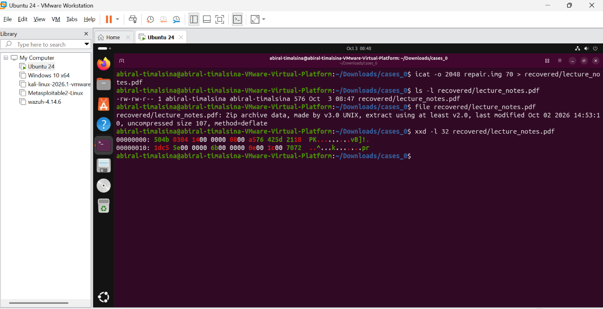
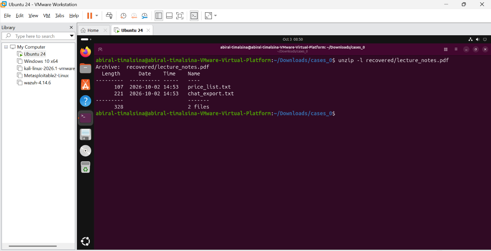

```bash
unzip recovered/lecture_notes.pdf -d recovered/notes
cat recovered/notes/price_list.txt
cat recovered/notes/chat_export.txt
```

```
PAPER PRICE LIST
DBMS full paper: Rs 1500 each
Bulk (5+ students): Rs 1200 each
Pay to: 9800000001 (eSewa)

[15/06 21:50] Sunil: paper ready, 2 pages
[15/06 21:52] B: how much?
[15/06 21:53] Sunil: 1500 each, send to 9800000001
[15/06 22:10] B: sent Rs 6000 for 4 friends
[15/06 22:12] Sunil: ok sending now. delete after seeing
```

Rs 6000 equals 4 × Rs 1500, and "2 pages" matches the two photographed pages.

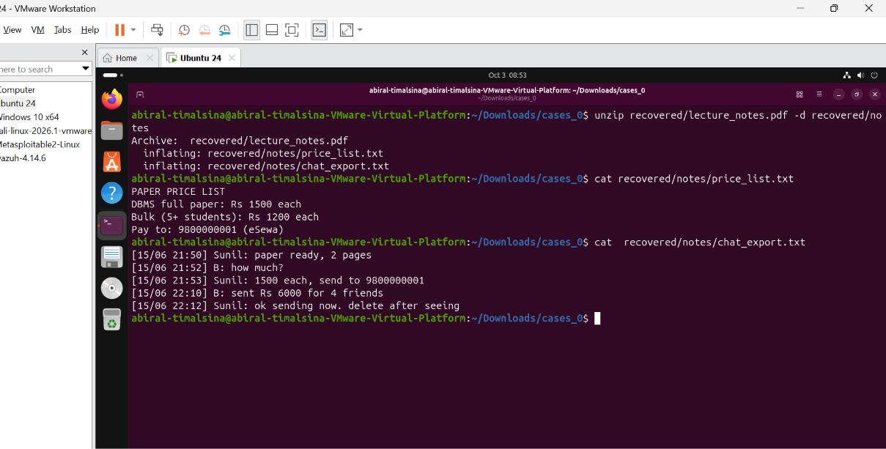

### Step 12: The hidden stream

The listing showed `CV_Sunil_Basnet.docx:secret.txt`, an NTFS alternate data stream that normal file browsers do not show.

```bash
icat -o 2048 repair.img 64-128-4
```

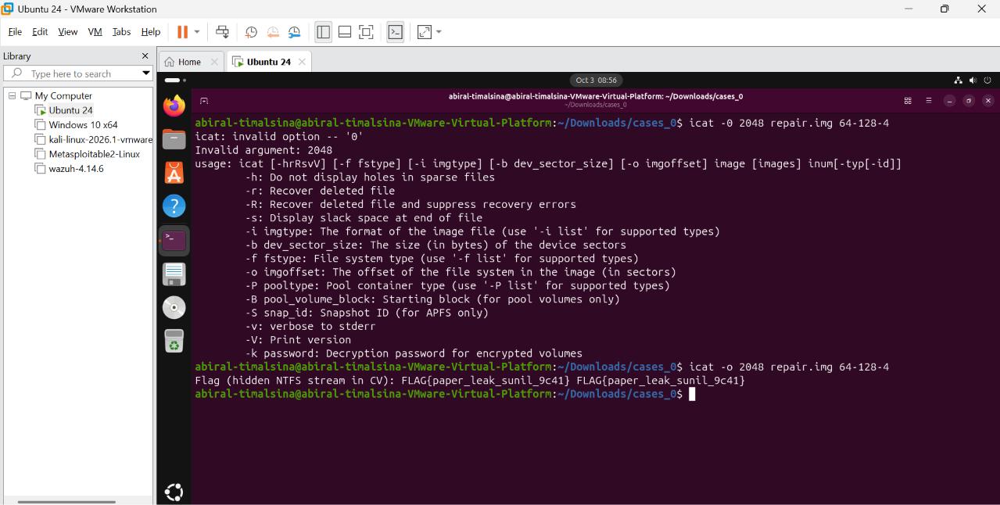

**Flag:** `FLAG{paper_leak_sunil_9c41}`

### Step 13: Timeline from the file system

```bash
fls -o 2048 -l -r -z Asia/Kathmandu repair.img | grep -v '\$'
istat -o 2048 -z Asia/Kathmandu repair.img 5
```

- All case files, including the three deleted ones, show **21:35:00** (the copy time). NTFS does not record a per-file deletion time.
- The CV and its hidden stream show **21:35:27**.
- The root folder's last modification is **22:20:09**. A folder changes when files are added or removed, so this is consistent with the deletions.

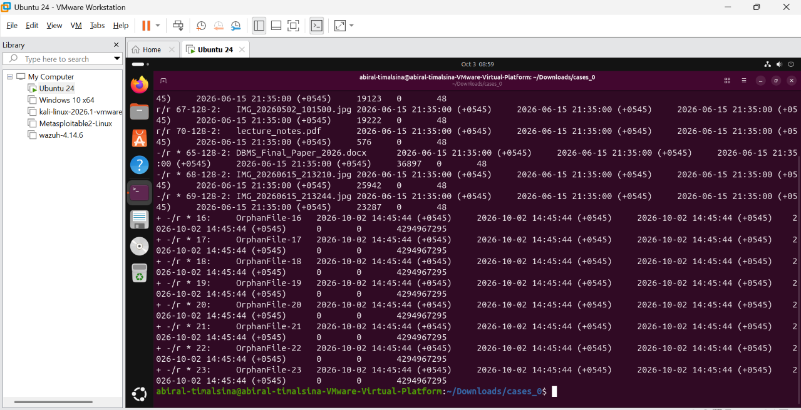
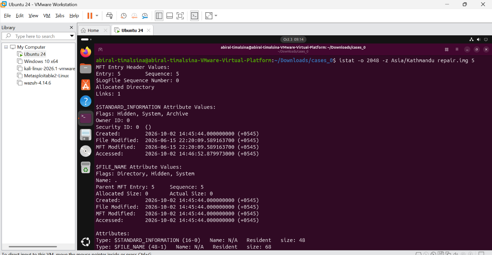

### Step 14: Final integrity check

```bash
sha256sum -c case01.sha256
```


---

## 4. Timeline (15 June 2026, Nepal time)

| Time | Event | Source |
|---|---|---|
| 20:45 | Exam paper last saved by Sunil Basnet | Document metadata (stored as UTC, see note below) |
| 21:32:10 / 21:32:44 | Two photos of the paper taken | Photo metadata |
| 21:35:00 | Files copied to the drive | File system times |
| 21:35:27 | CV modified (hidden stream added) | File system times |
| 21:50 | "paper ready, 2 pages" | Chat |
| 22:10 | Rs 6000 payment for 4 papers | Chat |
| 22:12 | "delete after seeing" | Chat |
| 22:20:09 | Folder last changed, consistent with deletion | `istat` |

---

## 5. Conclusion *(draft, edit in your own words)*

**Most likely responsible:** Sunil Basnet. The evidence is **consistent with** him selling the leaked paper. Hari Sharma appears only as the *author* of the document, which shows who wrote the paper, not who leaked it.

**Strongest evidence**
1. The recovered paper was last saved by Sunil Basnet, and photos of its two pages were taken on the same evening.
2. A ZIP disguised as `lecture_notes.pdf` holds a price list and a chat in which "Sunil" sells the paper for Rs 1500 and is paid Rs 6000 for four copies, followed by an instruction to delete.
3. The drive's folder was last changed at 22:20, eight minutes after that instruction, and the paper and its photos are the files that were deleted.

**What cannot be proven from this drive alone**
- That the "Sunil" in the chat is Sunil Basnet (a first name in a text file is only a lead).
- Who physically used the phone: the Redmi Note 11 is a common model and metadata can be edited.
- Who "B" is, and who owns the eSewa number (that needs payment records obtained through legal process).
- Exactly when each file was deleted (NTFS does not store a deletion time per file).

---

## 6. Anomalies noticed

An investigator should question these before relying on the timestamps:

- The document's description says `generated by python-docx` and its application says `Microsoft Macintosh Word`.
- Files inside the document and the ZIP carry a modification date of **2026-10-02**, not June.
- The drive's root folder shows a *created* date of 2026-10-02 although its contents are dated June 2026.
- Eight empty `OrphanFile` records dated 2026-10-02 are present.
- The document's times are stored in UTC, while the photos and the drive show local time, so times must be compared with care.

---

## 7. Lessons

- Always hash the evidence first and work on copies.
- A missing partition table does not mean the data is gone.
- Check a file's real type by its contents, not its name.
- Metadata and file system times are leads that need corroboration.
- Say "consistent with" unless something is actually proven.
