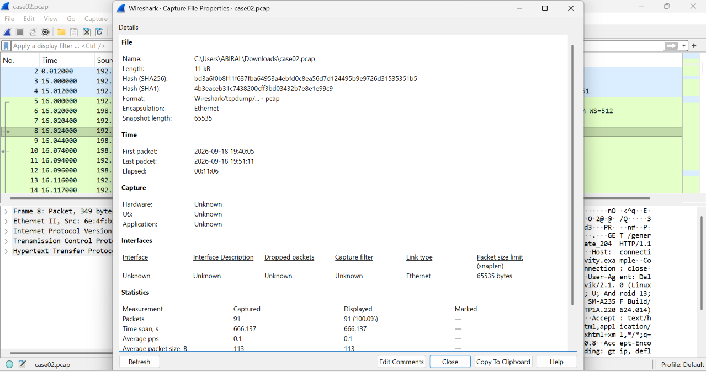
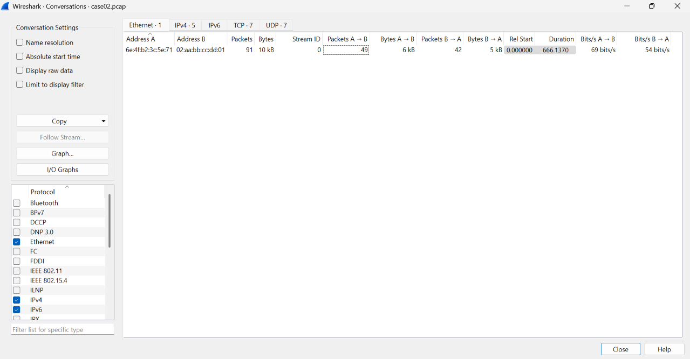
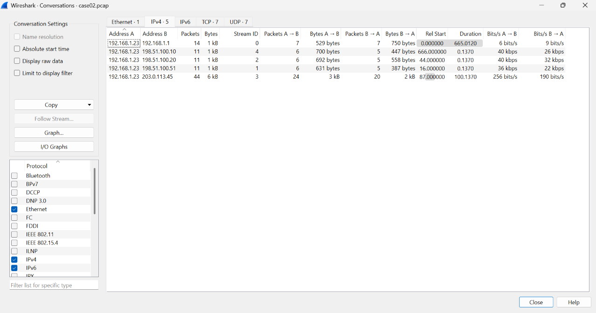
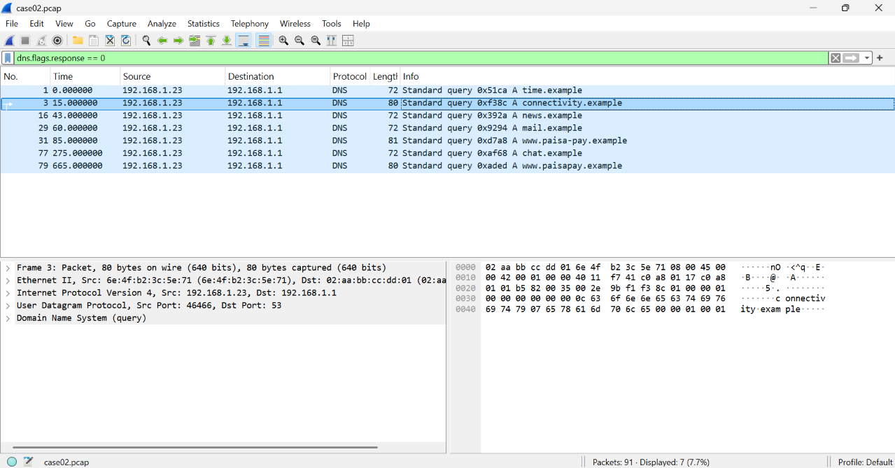
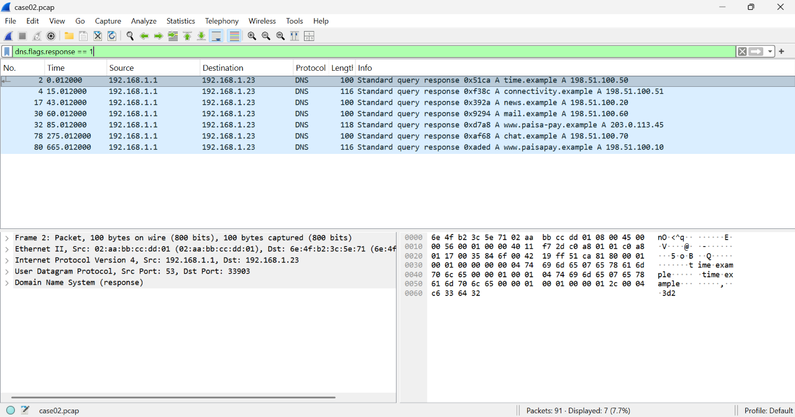
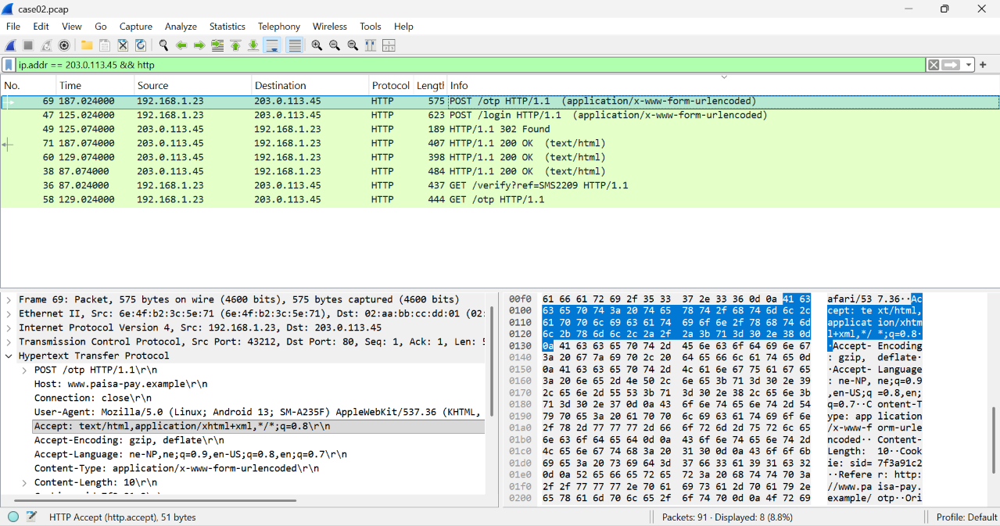
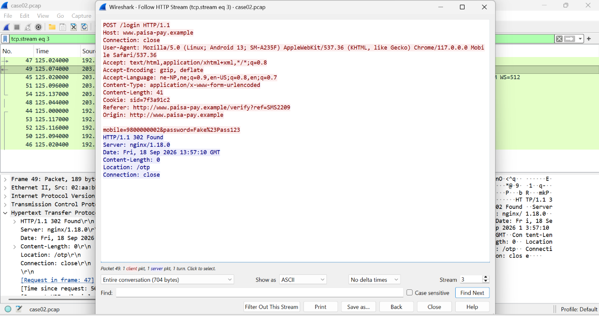
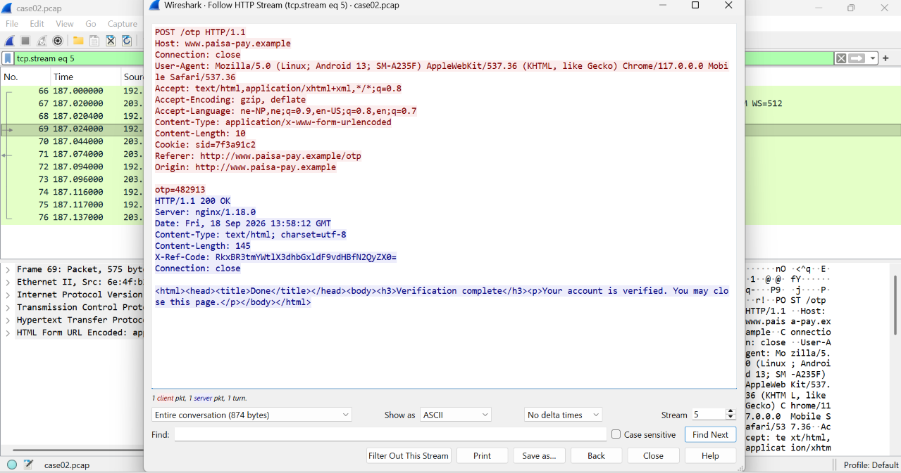
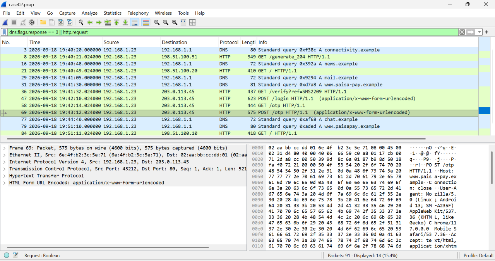

# Lab 1 Walkthrough: The Fake Wallet Link

> ⚠️ **Spoilers.** This is the solution to [Lab 1](../README.md), **except the flag**: it shows you where the flag is hidden, but you have to decode it yourself.

| | |
|---|---|
| **Case type** | Phishing / account takeover |
| **Evidence** | `case02.pcap`, a network capture from a home router |
| **Difficulty** | Easy to Medium |
| **Tools used** | Wireshark (file properties, Conversations, display filters, Follow HTTP Stream) |
| **Environment** | Windows 11 |
| **Author** | Abiral Timalsina |

All people, brands, domains, phone numbers and payments in this case are **fictional**.

---

## 1. Case brief

Sita Rai received an SMS asking her to verify her mobile wallet, followed the link, and lost Rs 45,000. Her router's capture of that evening is the evidence.

**Task:** find out what happened, and what the capture can and cannot prove.

## 2. Method

1. Verify the evidence
2. Get the big picture: who talks to whom
3. Read the DNS: which names were asked, and what did they resolve to
4. Read the web requests to the odd server
5. Follow the streams to see what was submitted
6. Look for anything unusual in the server's replies
7. Build the timeline
8. Conclude, and state what cannot be proven

---

## 3. Step by step

### Step 1: Verify the evidence

```
certutil -hashfile case02.pcap SHA256
```

The result must match the published SHA-256 of the capture: `bd3a6f0b8f11f637fba64953a4ebfd0c8ea56d7d124495b9e9726d31535351b5`.

In Wireshark, **Statistics > Capture File Properties** shows the same fingerprint, the first and last packet times (19:40:05 to 19:51:11, about 11 minutes) and the packet count (91).



### Step 2: Who is talking to whom?

**Statistics > Conversations**

- **Ethernet tab:** a single pair of addresses carries all 91 packets. The second address is the home router, so every server was reached through it.
- **IPv4 tab:** the phone `192.168.1.23` talks to five addresses. Four are short visits (11 packets, 0.14 s each) or the router. One, **`203.0.113.45`**, has **44 packets over 100 seconds**, four times the others, and it starts at 87 s.

That server is a lead, not proof. We need to read what was said.




### Step 3: DNS

Questions the phone asked (filter `dns.flags.response == 0`) and the answers (filter `dns.flags.response == 1`):

| Time | Name | Answer |
|---|---|---|
| 19:40:05 | `time.example` | 198.51.100.50 |
| 19:40:20 | `connectivity.example` | 198.51.100.51 |
| 19:40:48 | `news.example` | 198.51.100.20 |
| 19:41:05 | `mail.example` | 198.51.100.60 |
| **19:41:30** | **`www.paisa-pay.example`** | **203.0.113.45** |
| 19:44:40 | `chat.example` | 198.51.100.70 |
| **19:51:10** | **`www.paisapay.example`** | **198.51.100.10** |

Two names differ by **one hyphen**: `paisa-pay` and `paisapay`. The hyphenated one resolves to the odd server, and the phone connected to it two seconds after the lookup.




### Step 4: The web requests to the odd server

```
ip.addr == 203.0.113.45 && http
```

| Request | Server reply |
|---|---|
| `GET /verify?ref=SMS2209` | 200 OK, a page |
| `POST /login` | 302 Found, redirect to `/otp` |
| `GET /otp` | 200 OK, a page |
| `POST /otp` | 200 OK, a page |

Everything is plain `http`, not `https`, so the content is readable. Two POST requests mean the user typed something in twice.



### Step 5: What was submitted (Follow HTTP Stream)

Right-click a packet, then **Follow > HTTP Stream**.

**Stream 3, `POST /login`:**

```
mobile=9800000002&password=Fake%23Pass123
```

`%23` is the URL-encoded `#`, so the password is `Fake#Pass123`. The `User-Agent` shows a Samsung **SM-A235F** (the Galaxy A23) running Android 13 with Chrome 117.



**Stream 5, `POST /otp`:**

```
otp=482913
```

The one-time code was submitted about a minute after the login.

### Step 6: Something unusual in the reply

Look at the server's reply headers in stream 5. Most are normal (`Server`, `Date`, `Content-Type`, `Content-Length`, `Connection`). One is not:

```
X-Ref-Code: RkxBR3tmYWtlX3dhbGxldF9vdHBfN2QyZX0=
```

Headers beginning with `X-` are custom, and a value ending in `=` is typical of **Base64**. Decode it to get the flag. **The decoding is left for you.**

Ways to do it: PowerShell, `echo "..." | base64 -d` in Git Bash or Linux, or an online decoder such as CyberChef.



### Step 7: Timeline

Set **View > Time Display Format > Date and Time of Day**, then filter with `dns.flags.response == 0 || http.request`.



---

## 4. Timeline (18 Sep 2026, Nepal time)

| Time | Event |
|---|---|
| 19:40:20 and :21 | Android connectivity check (background) |
| 19:40:48 and :49 | `news.example` lookup and visit (background) |
| 19:41:05 | `mail.example` looked up only (background) |
| **19:41:30** | **DNS lookup of the lookalike `www.paisa-pay.example`** |
| **19:41:32** | **`GET /verify?ref=SMS2209`** |
| **19:42:10** | **`POST /login`** (mobile number and password) |
| 19:42:14 | `GET /otp` |
| **19:43:12** | **`POST /otp`** (one-time code) |
| 19:44:40 | `chat.example` looked up only |
| **19:51:10 and :11** | **The real name `www.paisapay.example` looked up, then visited** |

**Two independent clocks agree.** The server's own `Date` headers read 13:57:10 GMT for the login and 13:58:12 GMT for the OTP. Nepal is UTC+5:45, so these are 19:42:10 and 19:43:12, the same as Wireshark's packet times. Wireshark shows times in the examiner's own time zone, so always state which zone you used.

---

## 5. Conclusion *(draft, edit in your own words)*

**What happened:** the evidence is **consistent with** the phone user opening a link, probably from an SMS, that led to a lookalike site, `www.paisa-pay.example`, and giving it a mobile number, a password and then a one-time code. About eight minutes later the phone looked up and visited the real name, which is consistent with the user checking the real service.

**Strongest evidence**
1. The phone looked up the hyphenated lookalike domain, and connected to the server it resolved to, `203.0.113.45`, two seconds later.
2. Plain-text `POST` requests to that server carried the phone number, the password and the OTP, in that order, one minute apart.
3. The server's replies carry a hidden `X-Ref-Code` header, and it is the only address in the capture with a long conversation. Two clocks (packet times and the server's `Date` headers) agree on the timeline.

**What cannot be proven from this capture alone**
- Who runs `203.0.113.45`, and who received the details.
- That the SMS exists, or what it said (`ref=SMS2209` is only a hint).
- That money left an account. The capture shows the details being submitted, not any transfer.
- What the user did on the real site, because its traffic moved to encrypted HTTPS.
- Whether the number `9800000002` belongs to the victim, which needs the operator's records.

---

## 6. Lessons

- Start with the big picture (conversations, DNS) before reading packets.
- A lookalike domain can differ by a single character.
- Plain-HTTP forms expose everything that is typed into them.
- Custom headers can hide data. Look at every line of a reply.
- Say which time zone each time is in, and look for a second clock to confirm it.
- Say "consistent with" unless something is actually proven.
