# Lab 2: The Lost Bid: Walkthrough

> **Spoiler warning.** This page gives the answers. Try the lab first.
>
> Like the Lab 1 walkthrough, this page does **not** print the flag. It shows you how to find it.

This walkthrough uses **Autopsy 4.23.1 on Windows**. Other tools can do the same work.

---

## Step 0: Check the evidence

Unzip `case03.zip`. You get `case03.img`. Check its fingerprint.

```
certutil -hashfile case03.img SHA256
```

The result must be:

```
fa1c9664f2eb01b1e39a50ef67da7edecb20e8d4993c03e90a23020a894d6910
```

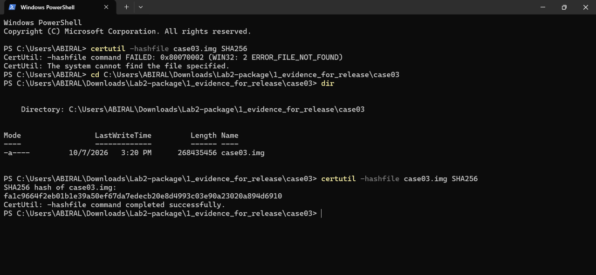

The size must be **268,435,456 bytes**. It is a match, so the evidence is untouched.

---

## Step 1: Start a new case in Autopsy

1. Open Autopsy and click **New Case**.
2. Case name: `Lab2_TheLostBid`. Choose a base folder, for example a `Cases` folder.
3. Leave the case type as **Single-User**. Click **Next**, then **Finish**.

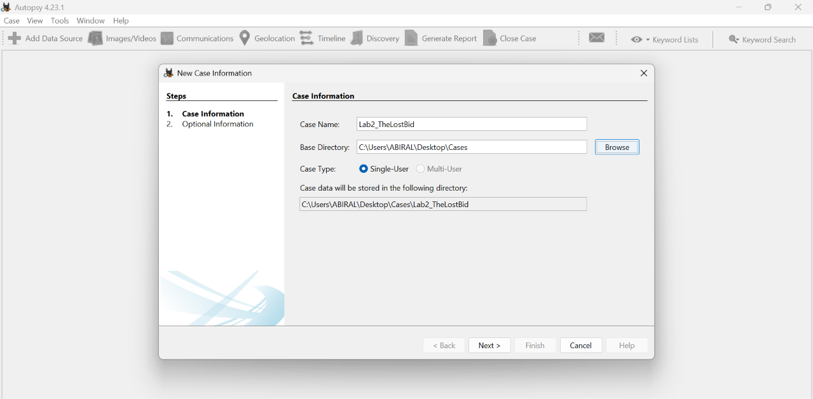

---

## Step 2: Add the disk image

1. On the **Select Host** page, keep the first option and click **Next**.
2. Choose **Disk Image or VM File** and click **Next**.

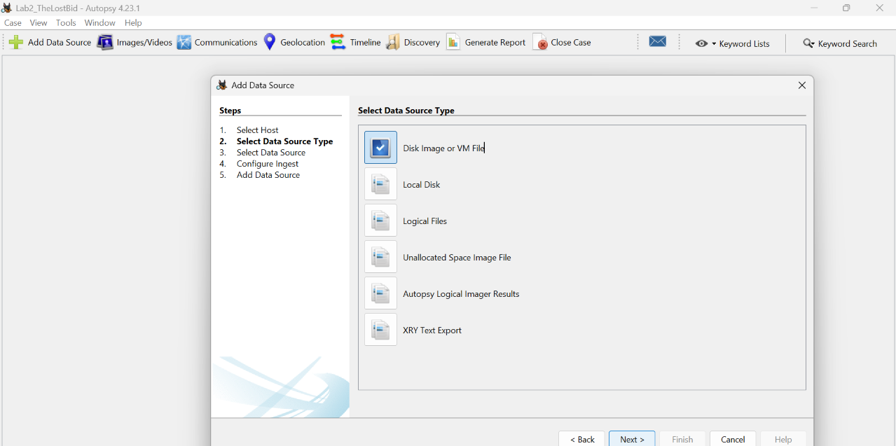

3. Browse to `case03.img`.
4. Set the time zone to **(GMT+5:45) Asia/Katmandu**. Autopsy spells it "Katmandu". This is the time zone of Nepal, where the case happened.
5. Leave **Ignore orphan files** unticked.

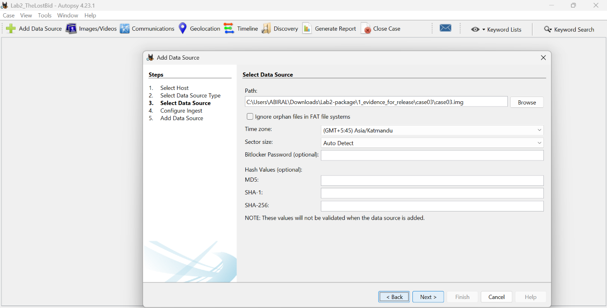

---

## Step 3: Choose the ingest modules

Ingest modules are the small programs that Autopsy runs on the evidence.

In Autopsy 4.23.1 most modules are ticked by default, including **PhotoRec Carver**. "Run ingest modules on" is set to **All Files, Directories, and Unallocated Space**.

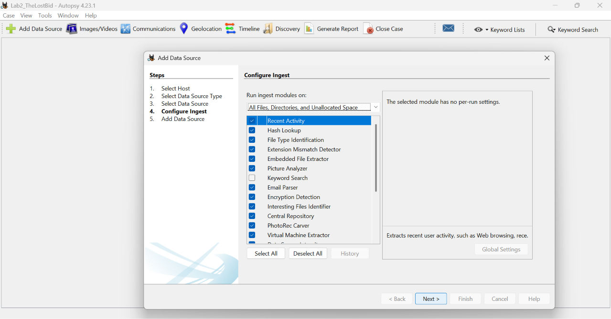

Do one extra thing: **tick Keyword Search**. It is not ticked by default, and you need it later.

Leave **OCR** unticked. Click **Next**, then **Finish**, and wait for the progress bar to go away.

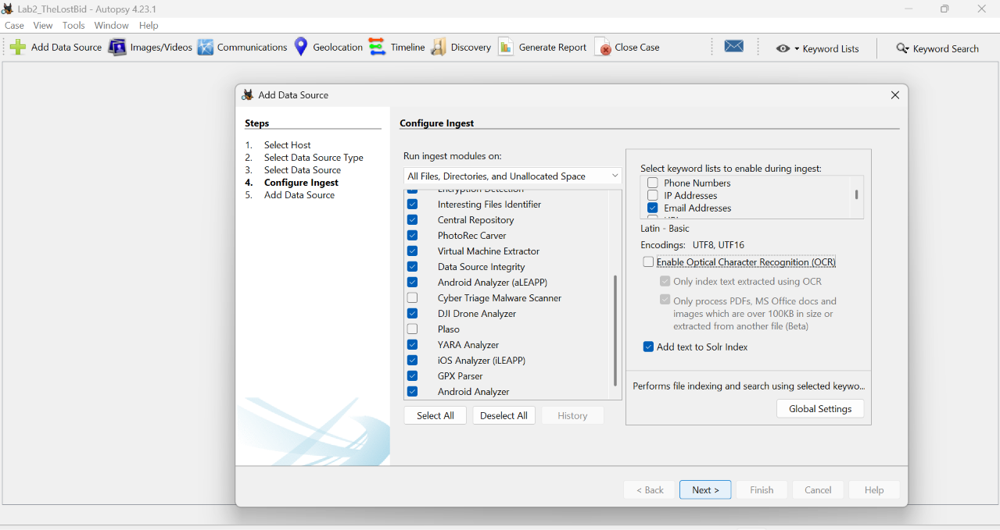

---

## Step 4: Look at the tree

In the left tree, open **Data Sources**, then the host, then the image, then the **vol2 (Win95 FAT32)** volume.

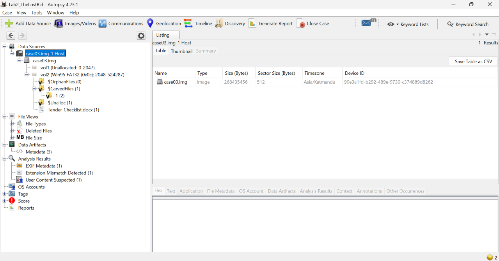

You can see:

- `vol2` is the real USB volume (FAT32), starting at sector 2048.
- `$OrphanFiles`, `$CarvedFiles` and `$Unalloc` are special folders made by Autopsy.
- `$CarvedFiles` is where files go that PhotoRec **recovered from empty space**. It holds **2 files**.

---

## Step 5: The files that have no name (Question 8)

On a FAT drive, a file is found through a **directory entry**. If there is no entry, the file system does not know the data exists. PhotoRec ignores the directory and looks for the **start of known file types** in the empty space. This is called **carving**.

1. Click the folder **1 (2)** under `$CarvedFiles`.

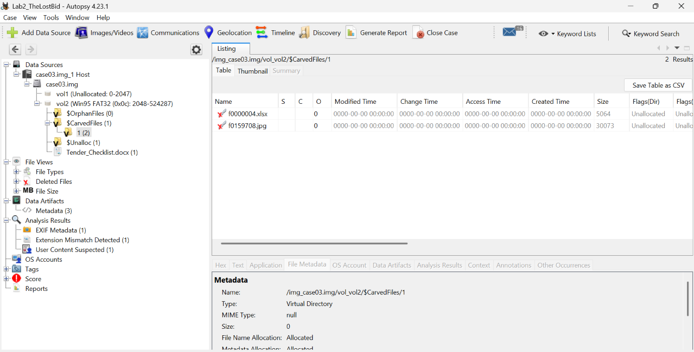

2. You see two files with no name and no dates:

| Carved file | Size | What it is |
|---|---|---|
| `f0000004.xlsx` | 5064 bytes | a spreadsheet |
| `f0159708.jpg` | 30073 bytes | a **picture** |

3. Click `f0159708.jpg` and open the **Application** tab at the bottom.
4. The picture holds two lines of text. The second line is the **flag** (**Question 8**).

**Why a keyword search will not find it:** the flag is *pixels in a picture*, not text. Step 10 proves this.

> **Note:** the carved spreadsheet is a copy of the deleted bid sheet. That is a second way to reach it (see Step 7).

---

## Step 6: Deleted files (Question 6)

1. In the left tree, open **Deleted Files**, then **File System**.

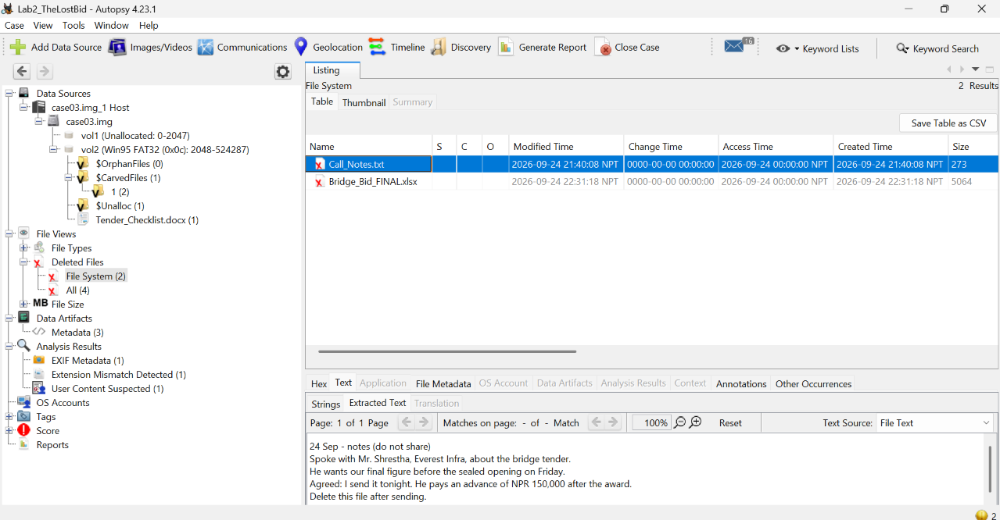

Two deleted files are listed:

| File | Modified (Nepal time) | Size |
|---|---|---|
| `Call_Notes.txt` | 2026-09-24 21:40:08 | 273 bytes |
| `Bridge_Bid_FINAL.xlsx` | 2026-09-24 22:31:18 | 5064 bytes |

2. Click `Call_Notes.txt`. In the **Text** tab, open **Extracted Text**.

The notes say that the writer spoke with **Mr. Shrestha of Everest Infra**, that the writer would send the final figure that night, and that an **advance of NPR 150,000** would be paid after the award. The note ends with "Delete this file after sending."

**Question 6 answer:** **Everest** (Everest Infra). Also useful: *Shrestha* and *advance*.

---

## Step 7: The deleted bid sheet (Questions 3 and 4)

Click `Bridge_Bid_FINAL.xlsx`. In the **Text > Extracted Text** panel scroll down.

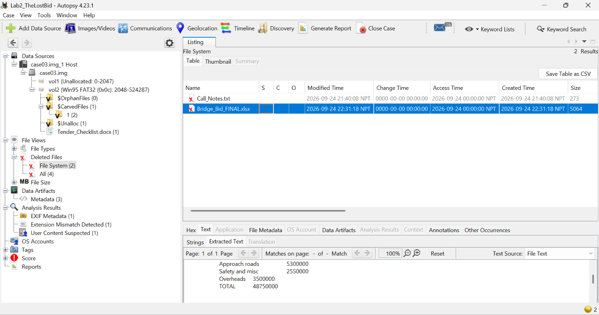

**Question 3 answer:** the total is **NPR 48,750,000**.

Scroll further down to the metadata part.

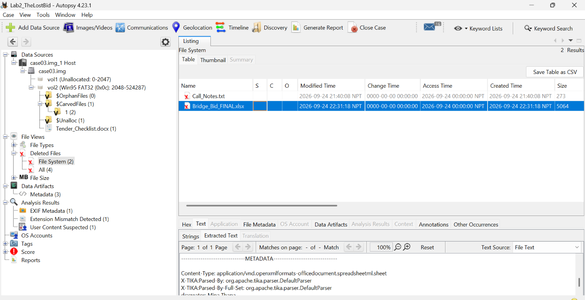

**Question 4 answer:** the creator and the last author are both **Mina Thapa**.

> **Careful, red herring.** Mina Thapa *prepared* the bid, so her name is on the sheet. That does **not** show she leaked it.

### A time zone trap

The sheet's inner dates are in **UTC** (the letter `Z` means UTC):

| Where | Value |
|---|---|
| Inside the file, modified | 2026-09-24 **16:46:15Z** |
| In Nepal time (UTC+5:45) | 2026-09-24 **22:31:15** |
| File system, modified | 2026-09-24 **22:31:18 NPT** |

They agree. The three seconds are normal: the file was saved, then written to the drive.

---

## Step 8: The file with the wrong name (Question 2)

Open **vol2** in the tree, and look at the file list. `Holiday_Songs.mp3` has a **warning triangle**. Autopsy found that its content does not match its `.mp3` ending (the **Extension Mismatch Detector** module).

You can also open **Analysis Results > Extension Mismatch Detected**.

Click the file, and open the **Application** tab.

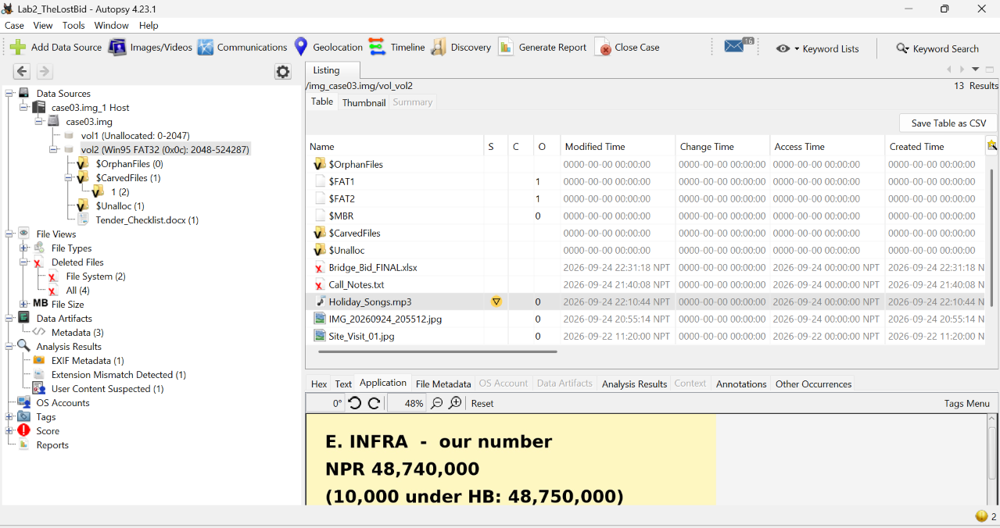

**Question 2 answer:** `Holiday_Songs.mp3` is really a **picture** (a JPEG). It says that Everest Infra's number is **NPR 48,740,000**, which is **10,000 below** Himalaya Build's 48,750,000.

---

## Step 9: The photo (Question 5)

Open **Analysis Results > EXIF Metadata**. One photo is listed: `IMG_20260924_205512.jpg`.

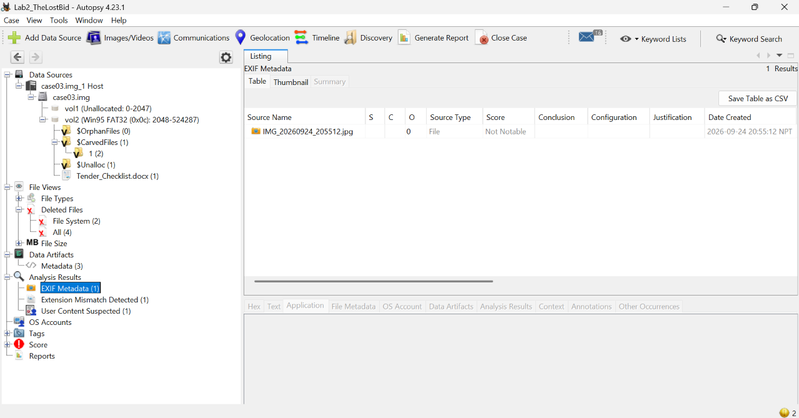

The camera time is **2026-09-24 20:55:12**.

For the phone and the artist, click the photo in the `vol2` file list, then open **Text > Extracted Text**:

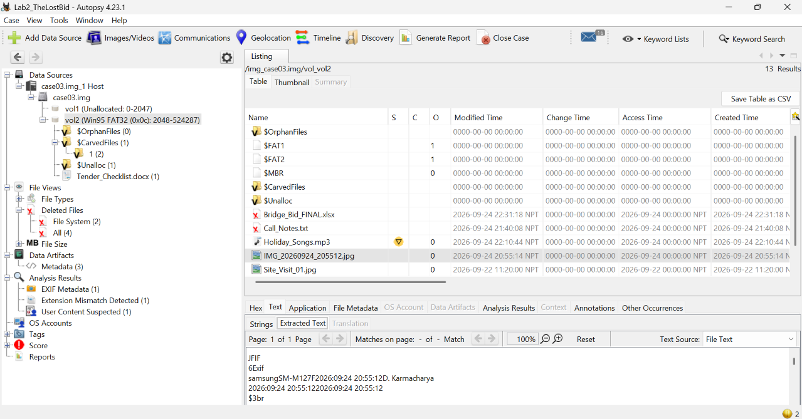

| Item | Value |
|---|---|
| Phone | **samsung SM-M127F** |
| Artist tag | **D. Karmacharya** |

<!-- TODO (author): confirm in Autopsy where the GPS columns show (scroll the EXIF Metadata table to the right), then replace this note with a screenshot. -->

**GPS.** The photo also stores GPS numbers:

- Latitude **27.7128 N**
- Longitude **85.3161 E**

Put them in any map. They point to the area of the **Garden of Dreams, Kathmandu**, a **public place**.

You can also read the GPS with ExifTool:

```
exiftool IMG_20260924_205512.jpg
```

**Careful:**

- `D. Karmacharya` is only initials and a surname. It points to a person but does **not** identify one.
- GPS in a photo shows where the **phone** was, not who it met.

---

## Step 10: Keyword search (Questions 6 and 8)

Use the **Keyword Search** box at the top right.

**Search for `Everest`:**

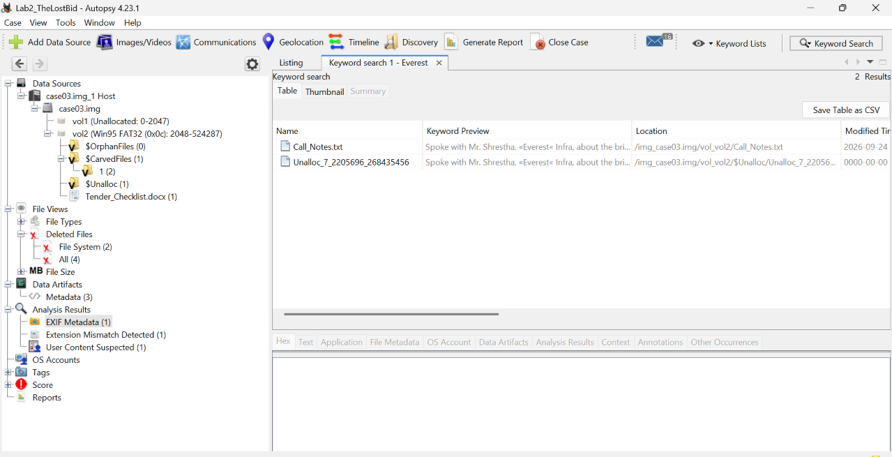

There are **2 hits**: the deleted `Call_Notes.txt`, and a block of **unallocated space** where the text of the deleted note is still sitting. Deleting a file does not wipe its data.

**Search for `FLAG`:**

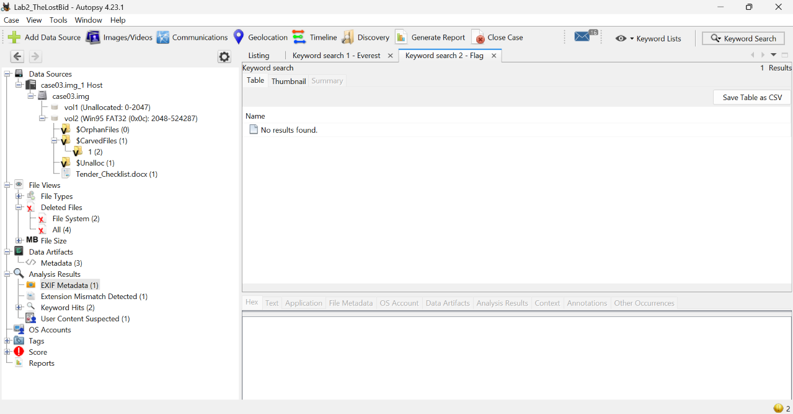

**No results.** The flag is a picture, so a text search cannot find it. A reader had to **look at the carved picture**.

---

## Step 11: The latest modified time (Question 7)

Of all the files on the drive, the **latest modified time** belongs to the deleted bid sheet:

**2026-09-24 22:31:18 (Nepal time, NPT, UTC+5:45)**

Here are the times of the other files on screen:

| File | Modified (NPT) |
|---|---|
| `Site_Visit_01.jpg` | 2026-09-22 11:20:00 |
| `IMG_20260924_205512.jpg` | 2026-09-24 20:55:14 |
| `Call_Notes.txt` (deleted) | 2026-09-24 21:40:08 |
| `Holiday_Songs.mp3` | 2026-09-24 22:10:44 |
| `Bridge_Bid_FINAL.xlsx` (deleted) | 2026-09-24 **22:31:18** |

**Careful:**

- FAT stores local time **without a time zone**. Your answer must say which zone you assumed.
- FAT records **no "deleted at" time**. You cannot say when a file was deleted.

---

## Step 12: Volume label and ID (Question 1)

<!-- TODO (author): confirm in Autopsy 4.23.1 where the volume label and Volume ID show (Data Source Summary / File Metadata of vol2), add a screenshot and the exact click path. -->

The volume label is the name of the drive, and the volume ID is a serial number made when the drive was formatted. They are kept in the **boot sector**.

**Question 1 answer:**

- Volume label: **TEAM_USB**
- Volume ID: **A1B2-C3D4**

---

## Answers

| # | Answer |
|---|---|
| 1 | Label `TEAM_USB`, Volume ID `A1B2-C3D4` |
| 2 | `Holiday_Songs.mp3` is really a JPEG. It shows the rival's figure, NPR 48,740,000 |
| 3 | `Bridge_Bid_FINAL.xlsx` (deleted). The total is NPR 48,750,000 |
| 4 | Mina Thapa |
| 5 | samsung SM-M127F. Artist tag `D. Karmacharya`. GPS 27.7128 N, 85.3161 E (Garden of Dreams area, Kathmandu) |
| 6 | `Everest` (also `Shrestha` and `advance`), in the deleted `Call_Notes.txt` |
| 7 | 2026-09-24 22:31:18, Nepal time. The file is the deleted `Bridge_Bid_FINAL.xlsx` |
| 8 | The flag written in the carved picture. Not printed here |
| 9 | See the sample conclusion below |

---

## Sample conclusion (Question 9)

> The pendrive links the bidding team to a meeting with the rival, Everest Infra. A deleted note says the writer would send "the final figure" to Mr. Shrestha of Everest Infra and would get an advance of NPR 150,000 after the award. A deleted spreadsheet holds Himalaya Build's total of NPR 48,750,000, saved at 22:31 (Nepal time) on 24 September. A picture stored under the name of a song shows the rival's number, NPR 48,740,000, which is exactly 10,000 below it. These facts are **consistent with** the leak of a sealed bid.
>
> The drive does **not prove** who leaked it. The author name Mina Thapa shows who prepared the bid, not who passed it on. The artist tag "D. Karmacharya" is only initials and a surname. The drive does not show who owns it, who deleted the files, or when they were deleted. It does not show that Mr. Shrestha received the figure, that the GPS place was a meeting place, or that this was the version of the bid that was submitted. The officer should look for further evidence, such as phone records and the company's own copy of the bid.

---

## What you learned

- **Deleted is not gone.** Deleted files can still be read, and their text can remain in free space.
- **Carving** finds data that has no directory entry.
- A **file name** can lie. Check the **content** (extension mismatch).
- **Metadata** (author, phone, GPS, time) tells a story, but each piece has limits.
- **Time zones** matter. FAT uses local time, Office files use UTC.
- A good report says what is **proven**, what is **consistent with**, and what is **unknown**.

---

© 2026 Abiral Timalsina. Licensed under [CC BY-NC-SA 4.0](../LICENSE). Credit **Abiral Timalsina** and link to this repository if you share or write about this lab.
